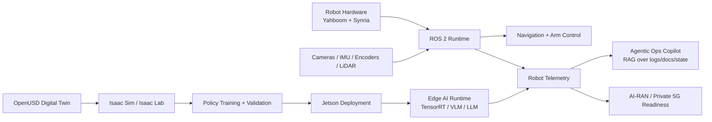

# Physical AI Jetson Robotics

Engineering platform for building, simulating, training, and deploying Physical AI systems with ROS 2, Isaac Sim, OpenUSD, LeRobot-style workflows, and NVIDIA Jetson edge hardware.

This repository is the flagship project in my AI systems portfolio. It connects robotics, simulation, edge AI, telemetry, and agentic operations into one reproducible path from digital twin to real hardware.

---

## Core Thesis

Physical AI systems need more than models.

They need:

- robot descriptions and simulation assets
- edge inference and runtime benchmarks
- ROS 2 control and telemetry
- OpenUSD / Isaac validation workflows
- sim-to-real deployment evidence
- safety-aware operations tooling
- agentic diagnostics over logs, docs, and robot state

This repository is designed to prove that full stack.

---

## What This Builds

- ROS 2 robot stacks for Yahboom ROSMASTER M3 Pro and Synria 6DOF arm workflows
- Isaac Sim / OpenUSD robot assets and factory-cell scenes
- MoveIt 2 and Gazebo smoke-test paths for robot description validation
- LeRobot-style training and reporting scaffolds for manipulation policies
- Jetson-oriented inventory, deployment, edge inference, and operations tooling
- RAG/agentic operations copilot experiments over robot telemetry and documentation
- AI-RAN and private 5G readiness concepts for robotics workloads

---

## Current Proof Points

| Area | Status | Evidence |
|---|---|---|
| Python package and CLI | Working | `physical_ai_lab/`, `tests/` |
| RTX simulation track | Working scaffold | `scripts/linux_rtx/`, `reports/simulation/` |
| Synria ROS 2 description | Working scaffold | `ros2_ws/src/synria_arm_description/` |
| Synria Isaac asset | Imported asset present | `isaac/usd/robots/synria_6dof_arm/` |
| Yahboom ROS 2 description | In progress | `ros2_ws/src/rosmaster_m3pro_description/` |
| Yahboom Isaac URDF | Generated and parses | `isaac/usd/robots/yahboom-rosmaster-m3-pro/` |
| LeRobot training path | Working scaffold | `reports/training/synria_reach_policy.json` |

---

## Architecture



---

## Signature Tracks

### 1. Mobile Robot Navigation and SLAM

Goal: build maps, localize, navigate, and validate robot behavior using ROS 2 and Jetson-class edge hardware.

Focus areas:

- Yahboom ROSMASTER M3 Pro / Orin NX workflows
- mecanum base calibration
- camera, IMU, wheel encoder, and optional LiDAR integration
- Nav2 / SLAM workflows
- simulation-to-real validation
- latency and runtime benchmarking

---

### 2. Robotic Arm Sim-to-Real Manipulation

Goal: validate 6DOF manipulation workflows from robot description through simulation, planning, and physical execution.

Focus areas:

- Synria 6DOF arm workflows
- MoveIt 2 planning
- ROS 2 control scaffolding
- wrist-camera perception path
- OpenUSD robot asset validation
- LeRobot / ALOHA-style demonstration data path

---

### 3. OpenUSD Digital Twin Factory Cell

Goal: create a reusable simulation environment for perception, manipulation, navigation, and safety validation.

Focus areas:

- robot and workcell assets
- synthetic camera views
- collision and safety zones
- sim-first validation before hardware execution
- Isaac / OpenUSD reporting artifacts

---

### 4. Edge AI Runtime and Physical AI Inference

Goal: benchmark and deploy perception, VLM, and LLM workloads on Jetson-class hardware.

Focus areas:

- ONNX / TensorRT workflows
- camera stream inference
- VLM/LLM edge reasoning
- memory, latency, throughput, power, and thermal observations
- runtime stability evidence

---

### 5. Robot Operations Copilot

Goal: build agentic workflows that reason over telemetry, logs, manuals, and task state.

Focus areas:

- local document ingestion
- robot telemetry analysis
- troubleshooting recommendations
- safety-bounded action planning
- operator-facing CLI/API interface

---

### 6. AI-RAN and Private 5G Robotics Readiness

Goal: connect robotics workloads to network intelligence and edge infrastructure planning.

Focus areas:

- simulated RAN / edge telemetry
- congestion and latency forecasting
- workload placement recommendations
- smart-factory robotics use cases

---

## Repository Layout

```text
.
├── agents/                 # Robot operations RAG and agentic diagnostics
├── arm_control/            # Robotic arm sim-to-real control modules
├── docs/                   # Architecture, hardware setup, business cases, roadmap
├── edge_ai/                # Jetson inference, optimization, and benchmarks
├── isaac/                  # Isaac Sim, Isaac Lab, and OpenUSD assets
├── physical_ai_lab/        # Shared Python package and CLI
├── ros2_ws/                # ROS 2 workspace and robot descriptions
├── slam/                   # Mobile robot SLAM and navigation modules
├── reports/                # Inventory, simulation, training, and bring-up evidence
├── scripts/                # Windows, Linux RTX, and Jetson helper scripts
├── tests/                  # Smoke tests and validation
└── .github/workflows/      # CI automation
```

---

## Robot Asset Layout

```text
isaac/usd/robots/
├── synria_6dof_arm/
│   ├── synria_6dof_arm.urdf
│   ├── synria_6dof_arm.usd
│   ├── synria_6dof_arm.usda
│   ├── source_urdf/
│   ├── configuration/
│   └── payloads/
├── yahboom-rosmaster-m3-pro/
│   ├── rosmaster_m3pro.urdf
│   └── source_urdf/
└── meshes/
```

Canonical editable ROS 2 sources stay in `ros2_ws/src/*_description/urdf/`. Isaac folders keep generated/import-ready copies.

---

## Quick Start

```bash
python3 -m venv .venv
source .venv/bin/activate
python -m pip install --upgrade pip
python -m pip install -e ".[dev]"
pytest -q
physical-ai-lab demo-telemetry
```

Windows PowerShell:

```powershell
python -m venv .venv
.\.venv\Scripts\Activate.ps1
python -m pip install --upgrade pip
python -m pip install -e ".[dev]"
pytest -q
physical-ai-lab demo-telemetry
```

---

## Workstation and Simulation Checks

```bash
bash scripts/linux_rtx/check_nvidia_stack.sh
bash scripts/linux_rtx/run_synria_moveit_smoke.sh
bash scripts/linux_rtx/run_ros_gazebo_factory_cell.sh
bash scripts/linux_rtx/render_factory_cell_blender.sh
```

Training scaffold:

```bash
physical-ai-lab rtx-projects
physical-ai-lab train-synria-reach --device cuda --samples 8192 --epochs 40
bash scripts/linux_rtx/run_rtx_training_suite.sh
```

---

## Hardware Evidence Workflow

Collect inventory evidence from each machine:

Windows:

```powershell
.\scripts\windows\collect_inventory.ps1
```

Linux RTX:

```bash
bash scripts/linux_rtx/collect_inventory.sh
```

Jetson:

```bash
bash scripts/jetson/collect_inventory.sh jetson-orin reports/inventory/yahboom_orin_nx.json
```

Then complete the relevant report templates:

- [Yahboom Bring-Up Template](reports/yahboom/BRINGUP_TEMPLATE.md)
- [Synria Bring-Up Template](reports/synria/BRINGUP_TEMPLATE.md)
- [OpenUSD / Isaac Template](reports/isaac/OPENUSD_TEMPLATE.md)
- [LeRobot / ALOHA Workflow](docs/LEROBOT_ALOHA.md)

---

## Execution Environments

This repository is intentionally split across three execution environments:

- **Windows development machine:** package development, docs, tests, agent/RAG work, GitHub publishing
- **Linux RTX workstation:** OpenUSD, Isaac Sim, Isaac Lab, ROS 2 simulation, synthetic data
- **Jetson Thor / Orin:** real robot deployment, edge inference, SLAM, robotic arm control, runtime benchmarks

Setup guides:

- [Environment Strategy](docs/ENVIRONMENT_STRATEGY.md)
- [Windows Development](docs/WINDOWS_DEV.md)
- [Linux RTX Setup](docs/LINUX_RTX_SETUP.md)
- [Jetson Deployment](docs/JETSON_DEPLOYMENT.md)
- [RTX Simulation and Training](docs/RTX_SIMULATION_TRAINING.md)
- [Flagship Differentiators](docs/FLAGSHIP_DIFFERENTIATORS.md)
- [Signature Demos](docs/SIGNATURE_DEMOS.md)
- [Milestones](docs/MILESTONES.md)

---

## Engineering Principles

- simulation first, real robot second
- reproducible setup over one-off demos
- explicit safety boundaries for robot actions
- benchmarked edge deployment
- observable systems with telemetry and logs
- business justification attached to technical tracks
- no production claims without evidence

---

## Current Status

This is an active engineering platform, not a finished product.

Current maturity:

> Working foundation with simulation, robot-description, CLI, training, and evidence scaffolds. Real hardware proof and runtime benchmark artifacts are being added incrementally.

---

## License

MIT License.
