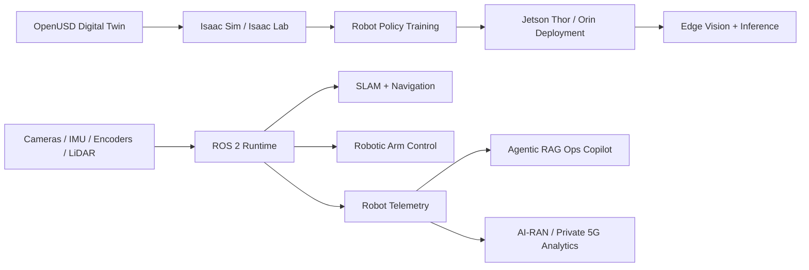

# Physical AI Jetson Robotics Lab

Robotics lab for building, simulating, training, and deploying mobile manipulation systems with ROS 2, Isaac Sim, OpenUSD, LeRobot, and NVIDIA Jetson edge hardware.

This repo is a practical engineering portfolio: robot descriptions, Isaac assets, simulation smoke tests, training configs, edge AI utilities, telemetry tooling, and operator-facing documentation live together so the path from digital twin to real hardware stays reproducible.

## What This Builds

- ROS 2 robot stacks for Yahboom ROSMASTER M3 Pro and Synria 6DOF arm workflows.
- Isaac Sim / OpenUSD robot assets and factory-cell scenes.
- MoveIt 2 and Gazebo smoke-test paths for robot description validation.
- LeRobot-style training and reporting scaffolds for manipulation policies.
- Jetson-oriented inventory, deployment, edge inference, and operations tooling.
- RAG/agentic operations copilot experiments over robot telemetry and docs.

## Current Proof Points

| Area | Status | Evidence |
| --- | --- | --- |
| Python package and CLI | Working | `physical_ai_lab/`, `tests/` |
| RTX simulation track | Working scaffold | `scripts/linux_rtx/`, `reports/simulation/` |
| Synria ROS 2 description | Working scaffold | `ros2_ws/src/synria_arm_description/` |
| Synria Isaac asset | Imported asset present | `isaac/usd/robots/synria_6dof_arm/` |
| Yahboom ROS 2 description | In progress | `ros2_ws/src/rosmaster_m3pro_description/` |
| Yahboom Isaac URDF | Generated and parses | `isaac/usd/robots/yahboom-rosmaster-m3-pro/` |
| LeRobot training path | Working scaffold | `reports/training/synria_reach_policy.json` |

## Robot Asset Layout

Robot assets are organized under `isaac/usd/robots/`.

```text
isaac/usd/robots/
├── synria_6dof_arm/
│   ├── synria_6dof_arm.urdf
│   ├── synria_6dof_arm.usd
│   ├── synria_6dof_arm.usda
│   ├── source_urdf/
│   ├── configuration/
│   └── payloads/
├── yahboom-rosmaster-m3-pro/
│   ├── rosmaster_m3pro.urdf
│   └── source_urdf/
└── meshes/
```

Canonical editable ROS 2 sources stay in `ros2_ws/src/*_description/urdf/`. The Isaac folders keep generated/import-ready copies.

## Demo Commands

Python package smoke test:

```bash
python3 -m venv .venv
source .venv/bin/activate
python -m pip install --upgrade pip
python -m pip install -e ".[dev]"
pytest -q
physical-ai-lab demo-telemetry
```

ROS 2 / Isaac workstation checks:

```bash
bash scripts/linux_rtx/check_nvidia_stack.sh
bash scripts/linux_rtx/run_synria_moveit_smoke.sh
bash scripts/linux_rtx/run_ros_gazebo_factory_cell.sh
bash scripts/linux_rtx/render_factory_cell_blender.sh
```

Training scaffold:

```bash
physical-ai-lab rtx-projects
physical-ai-lab train-synria-reach --device cuda --samples 8192 --epochs 40
bash scripts/linux_rtx/run_rtx_training_suite.sh
```

## Signature Demos

The public-facing demo tracks are documented in [docs/SIGNATURE_DEMOS.md](docs/SIGNATURE_DEMOS.md):

- Yahboom mobile manipulation bring-up
- Synria eye-in-hand manipulation
- OpenUSD digital twin v0
- Edge AI runtime benchmark
- Robot operations copilot
- AI-RAN robotics readiness

Milestone tracking lives in [docs/MILESTONES.md](docs/MILESTONES.md).

Production-ready Physical AI lab for NVIDIA Jetson Thor and Jetson Orin robotics: OpenUSD digital twins, Isaac Sim/Isaac Lab training, ROS 2 SLAM, edge vision, robotic arm control, and sim-to-real deployment.

## Mission

This repository is designed as a real-world robotics engineering portfolio project, not a notebook demo. It connects simulation, robot learning, edge AI, and field deployment into one practical lab for:

- autonomous robo car navigation and SLAM
- robotic arm manipulation and sim-to-real transfer
- OpenUSD digital twin scenes for synthetic data and validation
- LeRobot / ALOHA-compatible imitation learning for Synria arm demonstrations
- Jetson Thor/Orin edge inference and benchmarking
- robot operations telemetry, RAG, and agentic diagnostics
- AI-RAN/private 5G readiness for smart factory and edge robotics workloads

Signature project thesis:

> Physical AI Operations Stack for Mobile Manipulation: OpenUSD digital twins, Isaac training, ROS 2 deployment, Jetson edge inference, robot telemetry, safety/readiness scoring, and an agentic operations copilot.

## Why It Matters

Modern robotics teams need systems that can be trained in simulation, validated against digital twins, deployed on edge hardware, and monitored in production. This project demonstrates that full path using tools and patterns aligned with physical AI, industrial automation, autonomous systems, and edge intelligence.

Business use cases include:

- smart factory robot fleet monitoring
- warehouse AMR navigation and congestion avoidance
- robotic arm inspection, sorting, and pick-place tasks
- private 5G / AI-RAN edge robotics workload planning
- synthetic data generation for computer vision and safety testing

## Architecture



## Project Tracks

### 1. RoboCar SLAM and Visual Navigation

Build maps, localize, and navigate with ROS 2 on Jetson hardware.

Planned capabilities:

- Yahboom Orin NX 8GB ROS 2 robot car support
- mecanum wheel omnidirectional base calibration
- onboard 6DOF arm mobile manipulation path
- multimodal voice, vision, and display interaction experiments
- camera, IMU, wheel encoder, and optional LiDAR integration
- Isaac ROS Visual SLAM and/or Nav2 workflows
- obstacle avoidance and local planning
- simulation-to-real validation
- latency and FPS benchmarks on Jetson Orin and Thor

### 2. Robotic Arm Sim-to-Real Manipulation

Train and deploy manipulation policies for a real robotic arm.

Planned capabilities:

- Synria AI Robotic Arm Kit support, 6DOF, 650 mm reach, 1 kg payload
- Synria C10 wrist-camera perception
- ROS 2 Jazzy, MoveIt 2, and ROS 2 control simulation scaffolds
- LeRobot / ALOHA-compatible ACT policy training path
- OpenUSD robot asset and workcell setup
- Isaac Lab reaching, pick-place, and sorting tasks
- domain randomization for lighting, object pose, friction, and mass
- real-arm calibration and policy deployment
- success-rate and failure-mode reporting
- LeRobot / ALOHA-style demonstration data collection

### 3. OpenUSD Digital Twin Factory Cell

Create a simulation scene that acts as a testbed for vision, navigation, and robot operations.

Planned capabilities:

- USD scene layout for robo car, robotic arm, work surfaces, and markers
- synthetic camera generation
- object detection and pose-estimation datasets
- sim safety tests before real robot execution

### 4. Edge Vision and Physical AI Runtime

Deploy optimized perception and robot reasoning workloads to Jetson.

Planned capabilities:

- ONNX/TensorRT inference path
- camera stream inference
- CPU/GPU latency benchmarks
- optional VLM/LLM edge reasoning experiments
- power, thermals, memory, and throughput notes

### 5. Robot Operations Copilot

Use RAG and agentic workflows to reason over robot telemetry, logs, manuals, and task state.

Planned capabilities:

- local document ingestion
- structured robot telemetry analysis
- troubleshooting recommendations
- safety-bounded action planning
- operator-facing CLI/API interface

### 6. AI-RAN and Private 5G Robotics Readiness

Connect robotics workloads to network intelligence.

Planned capabilities:

- simulated RAN/edge telemetry
- congestion and latency forecasting
- workload placement recommendations
- smart-factory business case documentation

## Repository Layout

```text
.
├── agents/                 # Robot operations RAG and agentic diagnostics
├── arm_control/            # Robotic arm sim-to-real control modules
├── docs/                   # Architecture, hardware setup, business cases, roadmap
├── edge_ai/                # Jetson inference, optimization, and benchmarks
├── isaac/                  # Isaac Sim, Isaac Lab, and OpenUSD assets
├── physical_ai_lab/        # Shared Python package and CLI
├── ros2_ws/                # ROS 2 workspace placeholder
├── slam/                   # RoboCar SLAM and navigation modules
├── tests/                  # Cross-platform smoke tests
└── .github/workflows/      # Windows/Linux CI
```

## Quick Start

### Windows PowerShell

```powershell
python -m venv .venv
.\.venv\Scripts\Activate.ps1
python -m pip install --upgrade pip
python -m pip install -e ".[dev]"
pytest -q
physical-ai-lab demo-telemetry
```

### Linux

```bash
python3 -m venv .venv
source .venv/bin/activate
python -m pip install --upgrade pip
python -m pip install -e ".[dev]"
pytest -q
physical-ai-lab demo-telemetry
```

## Current Status

Milestone 1 is the production foundation:

- cross-platform Python package
- typed config models
- synthetic robot telemetry demo
- hardware inventory collector
- baseline business-case and architecture docs
- Windows/Linux CI
- smoke tests

Hardware integration, ROS 2 packages, Isaac scenes, and Jetson deployment scripts will be added incrementally.

## First Hardware Evidence

After setup, collect inventory evidence from each machine:

Windows:

```powershell
.\scripts\windows\collect_inventory.ps1
```

Linux RTX:

```bash
bash scripts/linux_rtx/collect_inventory.sh
```

Jetson:

```bash
bash scripts/jetson/collect_inventory.sh jetson-orin reports/inventory/yahboom_orin_nx.json
```

Then complete the relevant report template:

- [Yahboom Bring-Up Template](reports/yahboom/BRINGUP_TEMPLATE.md)
- [Synria Bring-Up Template](reports/synria/BRINGUP_TEMPLATE.md)
- [OpenUSD / Isaac Template](reports/isaac/OPENUSD_TEMPLATE.md)
- [LeRobot / ALOHA Workflow](docs/LEROBOT_ALOHA.md)

List the signature non-generic demo scenarios:

```bash
physical-ai-lab list-scenarios
physical-ai-lab scenario yahboom-mobile-manipulation
```

Run the RTX workstation simulation and training track:

```bash
physical-ai-lab rtx-projects
physical-ai-lab train-synria-reach --device cuda --samples 8192 --epochs 40
bash scripts/linux_rtx/run_rtx_training_suite.sh
```

See [RTX Simulation and Training](docs/RTX_SIMULATION_TRAINING.md).

## Hardware Targets

- NVIDIA Jetson Thor
- NVIDIA Jetson Orin
- robo car platform
- robotic arm platform
- USB/CSI cameras
- optional IMU, wheel encoders, and LiDAR

## Execution Environments

This repo is intentionally split across three machines:

- Windows development machine: package development, docs, tests, agent/RAG work, GitHub publishing
- Linux RTX workstation: OpenUSD, Isaac Sim, Isaac Lab, ROS 2 simulation, synthetic data
- Jetson Thor/Orin: real robot deployment, edge inference, SLAM, robotic arm control, benchmarks

Setup guides:

- [Environment Strategy](docs/ENVIRONMENT_STRATEGY.md)
- [Windows Development](docs/WINDOWS_DEV.md)
- [Linux RTX Setup](docs/LINUX_RTX_SETUP.md)
- [Jetson Deployment](docs/JETSON_DEPLOYMENT.md)
- [Synria Arm Plan](docs/SYNRIA_ARM_PLAN.md)
- [Yahboom Robot Car Plan](docs/YAHBOOM_ROBOT_CAR_PLAN.md)
- [Flagship Differentiators](docs/FLAGSHIP_DIFFERENTIATORS.md)
- [Signature Demos](docs/SIGNATURE_DEMOS.md)

## Engineering Principles

- simulation first, real robot second
- reproducible setup over one-off demos
- explicit safety boundaries for robot actions
- benchmarked edge deployment
- observable systems with telemetry and logs
- business justification attached to every technical track

## License

MIT License.
